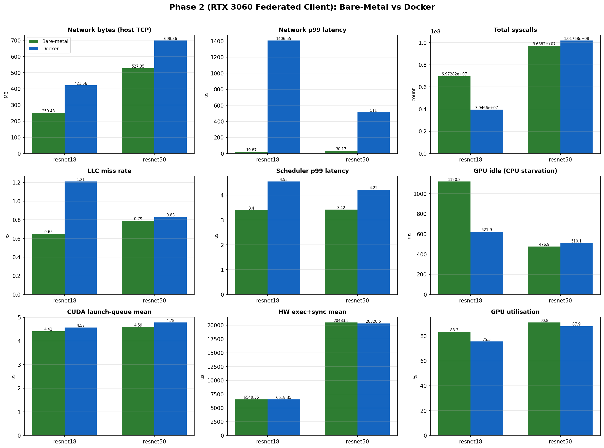
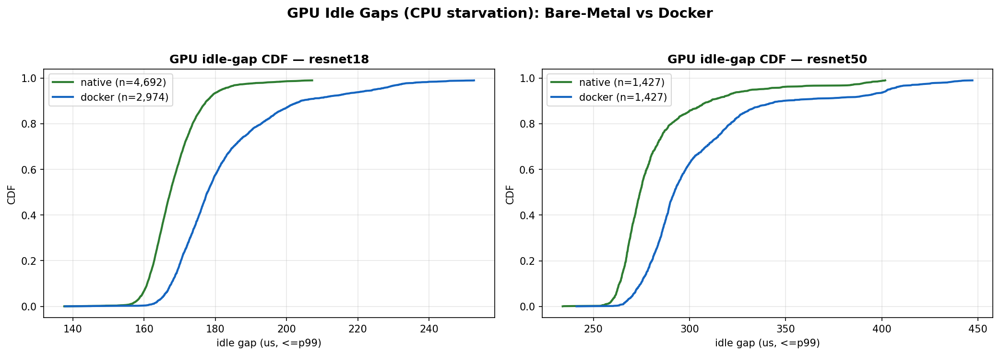

# ebpf-gpu-profiler

**Measuring the hidden OS-level cost of running GPU machine-learning workloads in Docker — using eBPF kernel tracing correlated with NVML GPU telemetry.**

Most "Docker has near-zero GPU overhead" claims look only at end-to-end
throughput. This suite goes a layer deeper. It attaches **eBPF** probes to the
Linux scheduler, the syscall layer, the TCP stack, the CPU performance-monitoring
unit (PMU), and the **CUDA user-space driver**, then lines those up with
**millisecond-resolution NVML** GPU counters. That exposes costs wall-clock
timing hides:

- **kernel-launch-bound GPU starvation** (the GPU sitting idle waiting for the CPU to issue the next kernel),
- **container network-path latency** (the veth/NAT bridge tax on distributed training), and
- **namespace-induced cache pollution** (extra last-level-cache misses).

The result is a reproducible, two-phase benchmarking harness plus the analysis
and visualisation tooling to turn the raw traces into a clear bare-metal vs.
Docker comparison.

---

## Table of contents
- [Key results](#key-results)
- [How it works](#how-it-works)
- [Two-phase architecture](#two-phase-architecture)
- [What gets measured](#what-gets-measured)
- [Repository layout](#repository-layout)
- [Hardware used](#hardware-used)
- [Setup](#setup)
- [Running the experiments](#running-the-experiments)
- [Analysis & visualisation](#analysis--visualisation)
- [Project status](#project-status)
- [Operational notes / troubleshooting](#operational-notes--troubleshooting)

---

## Key results

Phase 2 (distributed federated learning, profiled on an **RTX 3060** client
training on the full CIFAR-10 shard, exchanging weights with a remote parameter
server). Same workload, bare-metal vs. inside Docker (`--network=bridge`).

### Containerisation network tax (the headline)
Docker's bridge/NAT + veth path inflates the TCP latency tail by **1–2 orders
of magnitude** and roughly **doubles–triples** the number of network events for
an identical workload:

| Metric | resnet18 native | resnet18 docker | resnet50 native | resnet50 docker |
|---|--:|--:|--:|--:|
| TCP events captured | 32,120 | **89,959** | 47,081 | **91,898** |
| Net latency **p99** (µs) | 19.9 | **1,406.6** | 30.2 | **511.0** |
| Net latency mean (µs) | 37.7 | **231.2** | 54.2 | **177.1** |
| GPU utilisation (avg %) | 83.3 | 75.5 | 90.8 | 87.9 |
| LLC miss rate (%) | 0.65 | **1.21** | 0.79 | 0.83 |

Docker also **lowers average GPU utilisation** (cycles and time lost to the
container networking/runtime path) and **raises the LLC miss rate** — clearest
for the light resnet18, where namespace overhead is a larger fraction of the work.

### Dual-model regimes (bare metal)
The two architectures were chosen to stress different bottlenecks, and the
probes confirm the split:

| Signal | resnet18 | resnet50 | Interpretation |
|---|--:|--:|---|
| `cuLaunchKernel` count | 1,539,010 | 987,308 | r18 issues far more, smaller kernels |
| HW exec + sync mean (`cuStreamSynchronize`) | 6.5 ms | 20.5 ms | r50 spends much longer on-device per sync |
| **GPU idle gaps** total | **1,120 ms** (4,692 gaps) | 477 ms (1,427 gaps) | r18 is **kernel-launch-bound** — GPU starves waiting for the CPU |
| Network bytes (sum) | 250 MB | 527 MB | r50 is **communication-bound** — bigger gradients |

So **ResNet-18 = kernel-launch-bound CPU starvation**, **ResNet-50 =
communication-bound** — exactly the two regimes the suite set out to isolate.

### Figures




Full machine-readable numbers: [`results/phase2/plots/phase2_summary.json`](results/phase2/plots/phase2_summary.json).
Every run also emits a merged **Perfetto** trace (`perfetto_trace.json`) viewable
at [ui.perfetto.dev](https://ui.perfetto.dev) (kept local — see
[Project status](#project-status)).

---

## How it works

For each run, the host starts the full telemetry stack, runs the workload
(natively or in a container), stops the probes cleanly, and merges everything
into one timeline:

```
          ┌─────────────── host (root) ───────────────┐
          │  eBPF: sched · syscalls · TCP · LLC-PMU    │
          │  uprobes on libcuda: launch vs sync        │
          │  NVML: util/mem/PCIe/power  (~1 ms)        │
          └───────────────┬────────────────────────────┘
                          │ observes
   ┌──────────────────────▼───────────────────────┐
   │  workload  (bare metal  OR  docker container) │
   │  ResNet DDP (Phase 1) / FL client (Phase 2)   │
   └───────────────────────────────────────────────┘
                          │
                          ▼
        perfetto_exporter → single Chrome Trace JSON
```

### The "true execution probe"
A launch-only trace can't tell CPU-side overhead from real GPU work.
`cuda_uprobe_monitor.py` hooks **both** `cuLaunchKernel` (which only *enqueues*
work and returns — CPU-side driver cost) and `cuStreamSynchronize` (which
*blocks* until the device drains — real hardware execution + sync). The analysis
layer then derives **GPU idle gaps**: the time between a sync returning and the
next launch beginning, i.e. the direct measure of the CPU starving the GPU.

---

## Two-phase architecture

### Phase 1 — Vertical scaling (single node, multi-GPU) — `phase1_vertical_h100/`
A ResNet **DDP** workload on one multi-GPU node (designed for 2× H100). Profiles
intra-node behaviour: NCCL all-reduce, inter-GPU PCIe traffic, and per-step
kernel-launch overhead, bare-metal vs. container.

### Phase 2 — Horizontal scaling (distributed federated learning) — `phase2_horizontal_rtx3060/`
A profiled RTX 3060 **FL client** trains on its full CIFAR-10 shard for several
local epochs per round and exchanges weights with a remote parameter server
(an unprofiled peer). Profiles the **communication-bound** regime: the TCP path,
scheduler latency, and syscall/cache overhead of the container vs. the host.

### Dual-model design (`--arch resnet18 | resnet50`)
- **ResNet-18** — light kernels; the GPU drains its queue fast, so the limiter is
  how quickly the CPU issues the next kernel → exposes **kernel-launch-bound CPU
  starvation** (GPU idle gaps).
- **ResNet-50** — deep, bottleneck blocks, ~98 MB gradient tensors per update →
  exposes **communication-bound** PCIe / network synchronisation overhead.

---

## What gets measured

| Layer | Tool | Signal |
|---|---|---|
| Scheduler | `src/bpf_kernel/cpu_profiler.py` | context switches, run-queue latency |
| Syscalls | `src/bpf_kernel/syscall_counter.py` | per-syscall count + latency |
| Network | `src/bpf_kernel/net_profiler.py` | TCP send/recv bytes + latency |
| LLC cache | `src/bpf_kernel/llc_profiler.py` | last-level-cache misses via CPU PMU, per-cgroup (container) attribution |
| CUDA driver | `src/bpf_kernel/cuda_uprobe_monitor.py` | `cuLaunchKernel` queue overhead **vs.** `cuStreamSynchronize` hardware-exec+sync |
| GPU device | `src/telemetry/nvml_monitor.py` | utilisation, memory, **PCIe TX/RX**, power (NVML, ~1 ms loop) |
| Unified view | `src/telemetry/perfetto_exporter.py` | merges all of the above into a Chrome Trace Event JSON |

All per-event profilers are **memory-bounded** (`--max-events`) and stop cleanly
on signal, so a long capture on a busy host can't exhaust RAM.

---

## Repository layout

```
ebpf-gpu-profiler/
├── README.md
├── requirements.txt
├── Dockerfile                       # containerized workload image (CUDA 12.1 + torch)
├── setup/
│   ├── provision_profiled_node.sh   # one-shot: driver + BCC + torch + docker + toolkit
│   └── verify_node.sh               # post-reboot health check
├── src/
│   ├── bpf_kernel/                  # eBPF/BCC profilers
│   │   ├── cpu_profiler.py          # scheduler: ctx switches + run-queue latency
│   │   ├── syscall_counter.py       # per-syscall count + latency
│   │   ├── net_profiler.py          # TCP send/recv bytes + latency
│   │   ├── llc_profiler.py          # LLC misses via PMU (cgroup-aware)
│   │   ├── cuda_uprobe_monitor.py   # launch-queue vs HW-exec/sync uprobes
│   │   └── net_sched_monitor.py     # combined net + sched helper
│   └── telemetry/
│       ├── nvml_monitor.py          # ~1 ms NVML GPU sampler
│       └── perfetto_exporter.py     # merge eBPF + NVML -> Perfetto JSON
├── phase1_vertical_h100/
│   ├── resnet_ddp_workload.py       # ResNet-18/50 DDP on CIFAR-10
│   ├── run_native.sh                # bare-metal sweep (resnet18 + resnet50)
│   └── run_docker.sh                # containerized sweep
├── phase2_horizontal_rtx3060/
│   ├── fl_server.py fl_client.py fl_dataset.py fl_model.py fl_main.py
│   ├── run_server.sh                # FL parameter server (unprofiled peer)
│   ├── run_native_network.sh        # profiled bare-metal client
│   └── run_docker_network.sh        # profiled containerized client
├── analysis_and_plots/
│   ├── gpu_idle_gaps.py             # CPU-starvation metric + CDF plot
│   ├── phase2_compare.py            # bare-metal vs docker overview + summary
│   └── ... (correlation / aggregation helpers)
└── results/                         # outputs (raw CSV + Perfetto kept local; plots committed)
```

---

## Hardware used

| Role | Machine | GPU(s) | OS / kernel |
|---|---|---|---|
| Phase 1 (vertical) | dual-H100 server | 2× NVIDIA H100 NVL | Ubuntu, 6.8 |
| Phase 2 profiled client | workstation | NVIDIA RTX 3060 (12 GB) | Ubuntu 22.04, 6.8 |
| Phase 2 FL server peer | workstation | RTX A4000 + A6000 | Ubuntu 22.04 |

eBPF requires Linux (kernel ≥ 5.x) with kernel headers; the LLC profiler needs a
real CPU PMU (bare metal or a VM with vPMU). The profiled node needs root.

---

## Setup

eBPF profilers run as root under the **system** Python that carries the BCC
bindings; the workload + NVML need PyTorch (CUDA 12.1) and `nvidia-ml-py`.

Provision a profiled GPU node (Ubuntu 22.04) in one shot:

```bash
sudo bash setup/provision_profiled_node.sh   # driver, BCC, torch, docker, toolkit
sudo reboot                                   # load the NVIDIA kernel module
bash setup/verify_node.sh                      # confirm nvidia-smi / torch / bcc / docker-gpu
```

The FL server peer needs only PyTorch (no root): `run_server.sh` installs its
light deps (`fastapi uvicorn python-multipart requests tqdm`) into the user site
automatically.

> **BCC is not a pip package** — install it from the distro
> (`bpfcc-tools python3-bpfcc libbpfcc-dev linux-headers-$(uname -r)`).
> eBPF scripts run as:
> `sudo env PYTHONPATH=/usr/lib/python3/dist-packages python3 <script>.py`
> (the provided run scripts handle this for you).

---

## Running the experiments

### Phase 1 — single-node multi-GPU
```bash
# bare metal (sweeps resnet18 + resnet50 across all GPUs)
sudo ./phase1_vertical_h100/run_native.sh

# docker (build the image first)
docker build -t ebpf-gpu-profiler:latest .
sudo ./phase1_vertical_h100/run_docker.sh
```

### Phase 2 — distributed federated learning
```bash
# 1) on the server peer (binds 0.0.0.0:8100):
ARCH=resnet18 CLIENTS=1 ./phase2_horizontal_rtx3060/run_server.sh

# 2) on the profiled RTX 3060 client — bare metal, then docker:
sudo SERVER_URL=http://<server-ip>:8100 ./phase2_horizontal_rtx3060/run_native_network.sh
sudo SERVER_URL=http://<server-ip>:8100 ./phase2_horizontal_rtx3060/run_docker_network.sh
```
Restart `run_server.sh` between architectures (the server advances FedAvg rounds
per run). Each run writes `results/<phase>/<mode>_<arch>/` containing the eBPF
CSVs, `nvml_gpu.csv`, and a merged `perfetto_trace.json`.

Useful overrides: `ARCHS="resnet18 resnet50"`, `ROUNDS`, `LOCAL_EPOCHS`,
`GPUS`, `DUR_CAP`.

---

## Analysis & visualisation

```bash
# Bare-metal vs Docker overview (both arches) -> PNGs + summary JSON
python3 analysis_and_plots/phase2_compare.py \
    --results-base results/phase2 --archs resnet18 resnet50 \
    --out results/phase2/plots

# GPU idle gaps (CPU starvation), native vs docker, with CDF + percentile plot
python3 analysis_and_plots/gpu_idle_gaps.py \
    --cuda  results/phase2/native_resnet18/cuda_trace.csv \
    --cuda2 results/phase2/docker_resnet18/cuda_trace.csv \
    --label1 Native --label2 Docker \
    --plot results/phase2/plots/idle_resnet18.png

# Unified timeline: open any results/<run>/perfetto_trace.json at https://ui.perfetto.dev
```

---

## Project status

| Step | State |
|---|---|
| 1. Repo restructuring | ✅ done |
| 2. Code & telemetry upgrades | ✅ done (pynvml monitor, launch/sync probe, LLC PMU, dual-model, FL full-shard, Perfetto export) |
| 3a. **Phase 2** (RTX 3060 ⇄ FL server) | ✅ **complete** — native + Docker, resnet18 + resnet50, full telemetry + plots |
| 3b. **Phase 1** (2× H100 DDP) | ⏳ pending — H100 node shared with other users; runs once GPUs are free |
| 4. Analysis & docs | ✅ Phase 2 done; Phase 1 plots to follow its run |

Raw per-run CSVs and the (large) `perfetto_trace.json` files are kept **local
only** — they exceed GitHub's file-size limit and are reproducible from the run
scripts. The committed `results/phase2/plots/` (PNGs + `phase2_summary.json`)
capture the findings.

---

## Operational notes / troubleshooting

Lessons baked into the tooling (so you don't hit them):

- **Bounded profiler memory.** `sched_switch` fires on every context switch and
  `cuLaunchKernel` thousands of times/sec; the per-event profilers cap stored
  rows via `--max-events` (in-kernel aggregate counts stay exact). Without this a
  long capture on a busy host will OOM the box.
- **Clean profiler shutdown.** Background profilers are launched with `exec` so
  the captured PID is the real Python process and `SIGINT` reaches it (otherwise
  the workload finishes but the profilers orphan and hang).
- **NVML resolution.** The 1 ms target loop is limited by NVML's PCIe-throughput
  query (~20 ms internal window) to roughly tens of Hz on consumer GPUs;
  utilisation/power/memory update at the loop rate.
- **Docker + GPU.** Requires `nvidia-container-toolkit`
  (`nvidia-ctk runtime configure --runtime=docker`). The NVIDIA Container Toolkit
  bind-mounts the host `libcuda`, so host uprobes still see the container's CUDA
  calls.
- **Secure Boot.** If enabled, the NVIDIA driver's DKMS modules need MOK
  enrollment at the console on reboot.
- **FL server deps.** The server needs `python-multipart` for weight uploads;
  `run_server.sh` installs it.

## Requirements
PyTorch + torchvision (CUDA 12.1), `nvidia-ml-py`, numpy, matplotlib,
FastAPI + uvicorn + `python-multipart` (server only), requests, tqdm — see
`requirements.txt`. BCC + kernel headers come from the distro (see
[Setup](#setup)).
